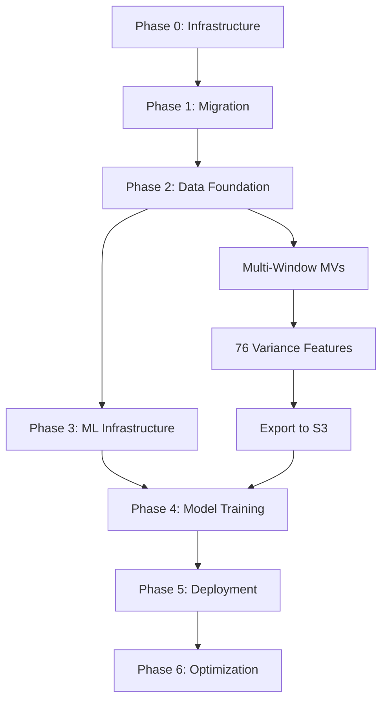

# BQX ML Migration & Execution Masterplan

**Version**: 1.0.0
**Created**: 2025-10-31
**Status**: Draft - Awaiting User Approval
**Ultimate Goal**: R² → 1.0 (Exact forex prediction across 28 pairs)

---

## Executive Summary

This masterplan details the complete migration of BQX ML context from the existing `bqx-db` repository to a new dedicated ML infrastructure consisting of:

1. **GitHub Repository**: `bqx-ml` (dedicated ML codebase, separate from data engineering)
2. **Airtable Base**: `BQX ML Project` (human-AI-agent collaboration platform)
3. **Vertex AI Project**: `bqx-ml` (ML training, deployment, monitoring)

The plan encompasses 7 phases executed over 45 days, from initial setup through production deployment and optimization, with the goal of achieving exact forex prediction (R² → 1.0) for 28 currency pairs.

**Key Metrics:**
- **Current State**: Phase 2 at 67%, 0 ML models trained, ~50 days behind timeline
- **Target State**: 6 SOTA architectures trained, ensemble R² > 0.95, production API deployed
- **Timeline**: 45 days (aggressive but achievable with proper planning)
- **Budget**: ~$2,500 total ($1,500 Vertex AI GPU training + $500 infrastructure + $500 buffer)

---

## Current State Analysis

### Existing Infrastructure (bqx-db)

**Database:**
- BigQuery (Google Cloud Platform)
- 27.6B rows across 28 pairs (2020-2025)
- 2.485 TB total size
- Dataset: `bqx_ml` (28 M1 tables + 28 MVs + regression tables)

**Compute:**
- GCE BQX-Master (n2-standard-16: 16 vCPU, 64 GB RAM)
- Cloud Dataflow (Phase 2 execution: 12 workers deployed)

**Features Completed:**
- Tier 1: Raw M1 data (100%)
- Tier 2: Engineered features (momentum, VWAP, returns, regression) (100%)
- Tier 3: Materialized views `mv_*` with 40 columns (100%)
- Tier 4: ML correlation features (80% - missing June-Oct 2025 data)

**Documentation:**
- `bqx/semantics.json` (v5.1.3, 1,196 lines) - system status
- `bqx/ontology.jsonld` (v5.1.2, 798 lines) - semantic definitions
- `config/triangulation_mapping.json` (1,175 lines) - data model
- `docs/MASTER_PLAN_DL_EXACT_PREDICTION.md` (v2.2.0, 925 lines)
- `docs/MASTER_ML_WORKPLAN.md` (v1.1.0, 443 lines)
- `docs/USER_EXPECTATIONS_REGRESSION_VARIANCE_ANALYSIS.md`
- `docs/REGRESSION_COMPONENT_COMPARISON_LOGIC.md` (668 lines)
- `docs/quadratic_regression_variable_rationalization.md` (113 lines)

### Critical Gaps Identified

**Gap 1: Multi-Window Regression (66% feature gap)**
- Current: Only 2 windows (w60, w90) in MVs
- Required: 6 windows (w60, w90, w150, w240, w390, w630)
- Impact: Cannot calculate cross-window variance features (21 features blocked)

**Gap 2: 76 Variance Features (0% implemented)**
- Same-pair cross-window: 21 features (0% complete)
- Cross-pair currency indices: 15 features (0% complete)
- Cross-window × cross-pair: 12 features (0% complete)
- R²/RMSE enhanced: 10 features (0% complete)
- Same-window/same-pair: 18 features (0% complete)

**Gap 3: ML Models (0% trained)**
- Expected: 6 SOTA architectures (TFT, Informer, Autoformer, FEDformer, PatchTST, TimesNet)
- Actual: 0 models
- Blocker: No Vertex AI infrastructure, no training scripts

**Gap 4: Production Deployment (0% complete)**
- No API infrastructure
- No real-time inference pipeline
- No monitoring/alerting
- No automated retraining

---

## Target State Definition

### GitHub Repository: bqx-ml

**Purpose**: Dedicated ML codebase, separate from data engineering (bqx-db)

**Structure:**
```
bqx-ml/
├── .github/
│   ├── workflows/
│   │   ├── vertexai-training.yml         # Trigger training jobs
│   │   ├── airtable-sync.yml             # Sync status to Airtable
│   │   └── model-deployment.yml          # Deploy to Vertex AI endpoints
├── config/
│   ├── semantics.json                    # Migrated from bqx-db
│   ├── ontology.jsonld                   # Migrated from bqx-db
│   ├── triangulation_mapping.json        # Migrated from bqx-db
│   └── vertexai_config.yaml              # Vertex AI project config
├── docs/
│   ├── MASTERPLAN.md                     # This document
│   ├── USER_EXPECTATIONS.md              # Migrated expectations
│   ├── VARIANCE_FEATURES.md              # 76 features definition
│   └── ARCHITECTURE.md                   # System architecture
├── scripts/
│   ├── data/
│   │   ├── create_multiwindow_mvs.sql    # Recreate MVs with 6 windows
│   │   ├── calculate_variance_features.py # 76 variance features
│   │   └── export_to_gcs.py              # Export training data to Cloud Storage
│   ├── ml/
│   │   ├── train_tft.py                  # Temporal Fusion Transformer
│   │   ├── train_informer.py             # Informer architecture
│   │   ├── train_autoformer.py           # Autoformer architecture
│   │   ├── train_fedformer.py            # FEDformer architecture
│   │   ├── train_patchtst.py             # PatchTST architecture
│   │   ├── train_timesnet.py             # TimesNet architecture
│   │   └── ensemble.py                   # Ensemble predictions
│   ├── integration/
│   │   ├── airtable_client.py            # Airtable API wrapper
│   │   └── cloudfunc_vertexai_airtable.py  # Cloud Functions → Airtable
│   └── deployment/
│       ├── inference.py                  # Vertex AI inference handler
│       └── api_gateway.py                # REST API for predictions
├── notebooks/
│   ├── 01_data_exploration.ipynb         # EDA on variance features
│   ├── 02_feature_selection.ipynb        # Select top features per pair
│   └── 03_model_comparison.ipynb         # Compare 6 architectures
├── models/
│   └── requirements.txt                  # PyTorch, pytorch-forecasting, etc.
├── terraform/
│   ├── vertexai.tf                       # Vertex AI resources
│   ├── cloudfunctions.tf                 # Cloud Functions
│   └── iam.tf                            # IAM roles
└── README.md
```

**Key Separation from bqx-db:**
- **bqx-db**: Data engineering (ingestion, transformation, database schema)
- **bqx-ml**: Machine learning (features, training, deployment)
- **Shared**: BigQuery dataset (read-only access from bqx-ml)

### Airtable Base: BQX ML Project

**Purpose**: Human-AI-agent collaboration platform for task tracking, progress monitoring, and metrics visualization

**Tables:**

**1. Epics** (7 high-level phases)
| Field | Type | Purpose |
|-------|------|---------|
| Epic Name | Single Line Text | Phase name |
| Phase | Single Select | Phase 0-6 |
| Status | Single Select | Not Started / In Progress / Completed / Blocked |
| Start Date | Date | Actual start |
| Target Date | Date | Deadline |
| Completion % | Number | Progress (0-100) |
| Description | Long Text | Epic objectives |

**2. Tasks** (200+ detailed work items)
| Field | Type | Purpose |
|-------|------|---------|
| Task Name | Single Line Text | Task description |
| Epic | Link to Epics | Parent epic |
| Status | Single Select | Pending / In Progress / Completed / Failed |
| Assignee | Link to Workers | Who's executing |
| Dependencies | Link to Tasks | Prerequisite tasks |
| Priority | Single Select | Critical / High / Medium / Low |
| Start Time | Date/Time | Actual start timestamp |
| End Time | Date/Time | Completion timestamp |
| Duration (hours) | Formula | End - Start |
| Progress % | Number | 0-100 |
| Output | Long Text | Results, GCS paths, metrics |
| GitHub PR | URL | Related PR if applicable |
| Vertex AI Job | Single Line Text | Training job name if applicable |

**3. Workers** (Human + AI agents)
| Field | Type | Purpose |
|-------|------|---------|
| Worker Name | Single Line Text | You / Claude / Vertex AI / Cloud Functions |
| Worker Type | Single Select | Human / AI / Service |
| Status | Single Select | Idle / Busy / Offline |
| Current Task | Link to Tasks | Active task |
| Tasks Completed | Rollup | Count of completed tasks |
| Total Hours | Rollup | Sum of task durations |

**4. Metrics** (Real-time ML performance tracking)
| Field | Type | Purpose |
|-------|------|---------|
| Metric Name | Single Line Text | R2_EURUSD_TFT, RMSE_GBPUSD_Informer |
| Task | Link to Tasks | Associated task |
| Timestamp | Date/Time | When metric recorded |
| Value | Number | Metric value |
| Target | Number | Goal value (e.g., 0.95 for R²) |
| Delta | Formula | Value - Target |
| Status | Formula | On Track / Below Target / Exceeds Target |

**5. Experiments** (Vertex AI training runs)
| Field | Type | Purpose |
|-------|------|---------|
| Experiment Name | Single Line Text | tft-eurusd-run-042 |
| Task | Link to Tasks | Parent task |
| Architecture | Single Select | TFT / Informer / Autoformer / etc. |
| Currency Pair | Single Select | EURUSD / GBPUSD / etc. |
| Hyperparameters | Long Text | JSON of hyperparameters |
| Training Status | Single Select | Running / Completed / Failed |
| Final R² | Number | Best validation R² |
| Final RMSE | Number | Best validation RMSE |
| Training Duration (min) | Number | Total training time |
| Cost ($) | Number | Vertex AI compute cost |
| Model GCS Path | URL | gs://bqx-ml-models/... |
| Vertex AI Job ID | Single Line Text | GCP resource ID |

**Views:**
- **Kanban**: Tasks grouped by Status
- **Gantt**: Tasks timeline with dependencies
- **Metrics Dashboard**: Real-time R² / RMSE tracking
- **Worker Utilization**: What each worker is doing
- **Experiment Leaderboard**: Top models by R²

### Vertex AI Project: bqx-ml

**Purpose**: End-to-end ML platform for training, deployment, and monitoring

**Components:**

**1. Vertex AI Workbench**
- Instance: `n1-standard-4` (development)
- User: `bqx-ml-user`
- VPC: Same as BigQuery (private subnet access)

**2. Vertex AI Experiments**
- Experiment groups:
  - `tft-training` (Temporal Fusion Transformer)
  - `informer-training`
  - `autoformer-training`
  - `fedformer-training`
  - `patchtst-training`
  - `timesnet-training`
  - `ensemble-validation`

**3. Vertex AI Training Jobs**
- Instance types:
  - Proof-of-concept: `n1-standard-8-nvidia-tesla-v100` (1 GPU, V100)
  - Production: `a2-highgpu-4g` (4 GPUs, A100)
  - Preemptible instances: 70% discount (use for non-critical runs)
- Framework: PyTorch 2.1.0
- Custom containers: Artifact Registry images with pytorch-forecasting

**4. Vertex AI Model Registry**
- Model packages per pair: 28 × 6 = 168 models
- Versioning: Automatic on each training completion
- Approval workflow: Auto-approve if R² > threshold

**5. Vertex AI Endpoints**
- Real-time inference: 1 endpoint per pair (28 total)
- Instance: `n1-standard-2`
- Auto-scaling: 1-4 instances based on request volume
- Multi-model endpoint: Single endpoint hosting all 28 models (cost optimization)

**6. Vertex AI Pipelines**
- Pipeline per pair: Data prep → Training → Evaluation → Registration → Deployment
- Triggered by: Cloud Storage data arrival, schedule (weekly), or manual

**7. Vertex AI Model Monitoring**
- Data quality monitoring: Detect drift in input features
- Model quality monitoring: Track R² degradation over time
- Alerts: Cloud Pub/Sub → Cloud Functions → Airtable (create "Retraining Needed" task)

**8. Cloud Storage Buckets**
- `gs://bqx-ml-features/`: Training data exported from BigQuery
  - `eurusd/train/` (2020-2024)
  - `eurusd/val/` (2024)
  - `eurusd/test/` (2025)
- `gs://bqx-ml-models/`: Trained model artifacts
- `gs://bqx-ml-experiments/`: Experiment logs, metrics, checkpoints

---

## Phase-by-Phase Execution Plan

### Phase 0: Infrastructure Setup (Days 1-3)

**Objective**: Establish GitHub, Airtable, and Vertex AI infrastructure

#### Step 0.1: Create GitHub Repository `bqx-ml`

**Duration**: 30 minutes
**Dependencies**: None
**Assignee**: User (with Claude assistance)
**Resources**: GitHub account

**Tasks:**
1. Create new repository: https://github.com/[org]/bqx-ml
2. Initialize with:
   - README.md (project overview)
   - .gitignore (Python, Jupyter, GCP)
   - LICENSE (MIT or Apache 2.0)
3. Set up branch protection:
   - `main` branch: Require PR reviews, status checks
   - `develop` branch: Active development
4. Create directory structure (as defined in Target State)
5. Add collaborators (if team members)

**Success Criteria:**
- ✅ Repository created and accessible
- ✅ Branch protection rules active
- ✅ Directory structure in place

**Airtable Update:**
```python
create_task({
    'name': 'Create GitHub repository bqx-ml',
    'epic': 'Phase 0: Infrastructure Setup',
    'status': 'In Progress'
})
```

---

#### Step 0.2: Create Airtable Base `BQX ML Project`

**Duration**: 1 hour
**Dependencies**: Step 0.1 (concurrent)
**Assignee**: Claude
**Resources**: Airtable token (already secured)

**Tasks:**
1. Create base via API (POST `/v0/meta/bases`)
2. Create 5 tables (Epics, Tasks, Workers, Metrics, Experiments)
3. Configure fields per Target State definition
4. Create 4 views per table:
   - Epics: List, Timeline
   - Tasks: Kanban (by Status), Gantt (by dates), My Tasks (filtered by assignee)
   - Workers: Grid, Utilization Chart
   - Metrics: Dashboard (grouped by metric type), Trends (line chart)
   - Experiments: Leaderboard (sorted by R²), Cost Analysis
5. Set up automations:
   - When Task status → "Completed", update Epic completion %
   - When Experiment R² > 0.95, send notification
6. Populate initial data:
   - 7 Epics (Phases 0-6)
   - 4 Workers (You, Claude, Vertex AI, Cloud Functions)

**Success Criteria:**
- ✅ Base created with all 5 tables
- ✅ All fields configured correctly
- ✅ Views functional
- ✅ Initial data populated

**Code:**
```python
# scripts/integration/setup_airtable.py
from pyairtable import Api

api = Api(airtable_token)
base = api.create_base(
    name="BQX ML Project",
    workspace_id=workspace_id,
    tables=[...]  # Full schema
)

# Populate Epics
epics_table = base.table('Epics')
epics_table.create({
    'Epic Name': 'Phase 0: Infrastructure Setup',
    'Phase': 'Phase 0',
    'Status': 'In Progress',
    'Target Date': '2025-11-03',
    'Description': 'Set up GitHub, Airtable, Vertex AI'
})
# ... repeat for Phases 1-6
```

---

#### Step 0.3: Set Up Vertex AI Workbench

**Duration**: 2 hours
**Dependencies**: None (concurrent with 0.1, 0.2)
**Assignee**: User (with Claude providing Terraform)
**Resources**: GCP account, VPC with BigQuery access

**Tasks:**
1. Create Vertex AI Workbench instance in same VPC as BigQuery
2. Create user profile: `bqx-ml-user`
3. Set up IAM roles:
   - `VertexAIExecutionRole`: Access to Cloud Storage, Artifact Registry, BigQuery (read-only)
   - `CloudFunctionExecutionRole`: Invoke Vertex AI, update Airtable
4. Create Cloud Storage buckets:
   - `gs://bqx-ml-features/`
   - `gs://bqx-ml-models/`
   - `gs://bqx-ml-experiments/`
5. Configure VPC endpoints for Vertex AI (no internet required)
6. Set up cost allocation labels: `project=bqx-ml`

**Terraform:**
```hcl
# terraform/vertexai.tf
resource "google_notebooks_instance" "bqx_ml" {
  name         = "bqx-ml-workbench"
  location     = var.region
  machine_type = "n1-standard-4"

  vm_image {
    project      = "deeplearning-platform-release"
    image_family = "tf-latest-gpu"
  }

  network = google_compute_network.vpc.name
  subnet  = google_compute_subnetwork.subnet.name
}

resource "google_storage_bucket" "ml_features" {
  name     = "bqx-ml-features"
  location = var.region

  lifecycle_rule {
    condition {
      age = 90
    }
    action {
      type          = "SetStorageClass"
      storage_class = "NEARLINE"
    }
  }
}
```

**Success Criteria:**
- ✅ Vertex AI Workbench instance created and accessible
- ✅ User can launch JupyterLab
- ✅ Cloud Storage buckets created
- ✅ IAM roles configured with least privilege

**Cost:** ~$0 (Studio domain is free, pay per instance usage)

---

#### Step 0.4: Create Cloud Function for Vertex AI → Airtable Integration

**Duration**: 2 hours
**Dependencies**: Step 0.2 (Airtable base exists)
**Assignee**: Claude
**Resources**: Cloud Functions, Cloud Pub/Sub, Secret Manager

**Tasks:**
1. Store Airtable token in Secret Manager: `bqx-airtable-api-token`
2. Store Airtable base ID in Secret Manager: `bqx-airtable-base-id`
3. Create Cloud Function: `vertexai-to-airtable`
   - Runtime: Python 3.11
   - Memory: 256 MB
   - Timeout: 60 seconds
   - Environment: VPC (same as Vertex AI for BigQuery access if needed)
4. Create Cloud Pub/Sub topic: `vertexai-training-events`
   - Subscribe to Vertex AI training job state changes
   - Trigger Cloud Function
5. Deploy Cloud Function
6. Test with mock Vertex AI event

**Cloud Function Code:**
```python
# scripts/integration/cloudfunc_vertexai_airtable.py
import json
import requests
import os
from google.cloud import secretmanager
from google.cloud import aiplatform

def get_secret(secret_id):
    client = secretmanager.SecretManagerServiceClient()
    project_id = os.environ['GCP_PROJECT_ID']
    name = f"projects/{project_id}/secrets/{secret_id}/versions/latest"
    response = client.access_secret_version(request={"name": name})
    return response.payload.data.decode("UTF-8")

def vertexai_to_airtable(request):
    # Get Airtable credentials
    airtable_token = get_secret('bqx-airtable-api-token')
    base_id = get_secret('bqx-airtable-base-id')

    # Parse Vertex AI event
    event_data = request.get_json()
    job_name = event_data['name']
    job_status = event_data['state']

    # Initialize Vertex AI
    aiplatform.init(project=os.environ['GCP_PROJECT_ID'])

    # Get job details
    job = aiplatform.CustomTrainingJob.get(job_name)

    # Extract metrics
    metrics = {}
    if job.metrics:
        metrics = job.metrics

    # Find corresponding task in Airtable by Vertex AI job name
    tasks_url = f"https://api.airtable.com/v0/{base_id}/Tasks"
    headers = {'Authorization': f'Bearer {airtable_token}'}

    # Search for task
    params = {'filterByFormula': f"{{Vertex AI Job}}='{job_name}'"}
    response = requests.get(tasks_url, headers=headers, params=params)
    records = response.json().get('records', [])

    if not records:
        print(f"No task found for job {job_name}")
        return {'statusCode': 404}

    record_id = records[0]['id']

    # Update task
    update_data = {
        'fields': {
            'Status': 'Completed' if job_status == 'SUCCEEDED' else 'Failed',
            'End Time': event_data['updateTime'],
            'Output': json.dumps(metrics, indent=2)
        }
    }

    if job_status == 'SUCCEEDED' and 'validation_r2' in metrics:
        update_data['fields']['Progress %'] = 100

        # Also create metric record
        metrics_url = f"https://api.airtable.com/v0/{base_id}/Metrics"
        requests.post(metrics_url, headers=headers, json={
            'fields': {
                'Metric Name': f"R2_{job_name}",
                'Task': [record_id],
                'Timestamp': event_data['updateTime'],
                'Value': metrics['validation_r2'],
                'Target': 0.95
            }
        })

    requests.patch(f"{tasks_url}/{record_id}", headers=headers, json=update_data)

    return {'statusCode': 200, 'body': f'Updated task for {job_name}'}
```

**Terraform:**
```hcl
# terraform/cloudfunctions.tf
resource "google_cloudfunctions_function" "vertexai_to_airtable" {
  name        = "vertexai-to-airtable"
  runtime     = "python311"
  entry_point = "vertexai_to_airtable"

  source_archive_bucket = google_storage_bucket.functions.name
  source_archive_object = google_storage_bucket_object.function_code.name

  trigger_http = true

  environment_variables = {
    GCP_PROJECT_ID = var.project_id
  }
}

resource "google_pubsub_topic" "vertexai_events" {
  name = "vertexai-training-events"
}

resource "google_pubsub_subscription" "function_trigger" {
  name  = "vertexai-to-airtable-subscription"
  topic = google_pubsub_topic.vertexai_events.name

  push_config {
    push_endpoint = google_cloudfunctions_function.vertexai_to_airtable.https_trigger_url
  }
}
```

**Success Criteria:**
- ✅ Cloud Function deployed and functional
- ✅ Pub/Sub subscription active
- ✅ Test event successfully updates Airtable

**Cost:** ~$0.20/month (within free tier for expected volume)

---

#### Step 0.5: Secure Airtable Token in GCP Secret Manager

**Duration**: 15 minutes
**Dependencies**: Step 0.2 (token exists)
**Assignee**: Claude
**Resources**: GCP Secret Manager

**Tasks:**
1. Create secret: `bqx-airtable-api-token`
2. Create secret: `bqx-airtable-base-id` (once base created)
3. Grant Cloud Function read access to secrets
4. Test retrieval from Cloud Function

**Command:**
```bash
echo -n 'YOUR_AIRTABLE_API_KEY' | \
  gcloud secrets create bqx-airtable-api-token \
  --data-file=-

echo -n 'appR3PPnrNkVo48mO' | \
  gcloud secrets create bqx-airtable-base-id \
  --data-file=-
```

**Success Criteria:**
- ✅ Secrets stored in Secret Manager
- ✅ Cloud Function can retrieve secrets
- ✅ Token removed from plaintext files

**Cost:** $0.40/month per secret × 2 = $0.80/month

---

### Phase 0 Summary

**Duration**: 3 days
**Tasks**: 5 steps
**Cost**: ~$1/month infrastructure
**Deliverables:**
- ✅ GitHub repository `bqx-ml` with structure
- ✅ Airtable base `BQX ML Project` with 5 tables
- ✅ Vertex AI Workbench operational
- ✅ Cloud Function integration Vertex AI → Airtable
- ✅ Secrets secured in Secret Manager

**Dependencies for Phase 1:**
- GitHub repo exists (for migration)
- Airtable base exists (for task tracking)
- Vertex AI ready (for future training)

**Airtable Status Update:**
```python
update_epic({
    'Epic Name': 'Phase 0: Infrastructure Setup',
    'Status': 'Completed',
    'Completion %': 100
})
```

---

## Phase 1: Context Migration (Days 4-5)

**Objective**: Migrate all context, semantics, ontology, user expectations, and workplans from `bqx-db` to `bqx-ml`

#### Step 1.1: Migrate Semantic Files

**Duration**: 2 hours
**Dependencies**: Phase 0 complete
**Assignee**: Claude
**Resources**: Git access to both repos

**Tasks:**
1. Copy files from `bqx-db` to `bqx-ml`:
   - `bqx/semantics.json` → `config/semantics.json`
   - `bqx/ontology.jsonld` → `config/ontology.jsonld`
   - `config/triangulation_mapping.json` → `config/triangulation_mapping.json`
2. Update references:
   - Change `bqx-db` paths to `bqx-ml` paths
   - Update version numbers (semantics.json v5.1.3 → v6.0.0 "ML Migration")
3. Add ML-specific context to semantics.json:
   - Vertex AI project ID
   - Airtable base ID
   - Cloud Storage bucket names
   - Cloud Function URLs
4. Commit to `bqx-ml` repo

**Success Criteria:**
- ✅ All 3 files migrated
- ✅ References updated
- ✅ Versioning incremented
- ✅ Committed to GitHub

**Git Commands:**
```bash
# From bqx-db
cp bqx/semantics.json ../bqx-ml/config/
cp bqx/ontology.jsonld ../bqx-ml/config/
cp config/triangulation_mapping.json ../bqx-ml/config/

cd ../bqx-ml
git add config/
git commit -m "Migrate semantic files from bqx-db

- semantics.json v5.1.3 → v6.0.0 (ML Migration)
- ontology.jsonld v5.1.2 → v6.0.0
- triangulation_mapping.json (unchanged)

Added ML-specific context:
- SageMaker project: bqx-ml
- Airtable base: BQX ML Project
- S3 buckets: bqx-ml-features, bqx-ml-models"
git push origin main
```

---

#### Step 1.2: Migrate Documentation

**Duration**: 3 hours
**Dependencies**: Step 1.1
**Assignee**: Claude
**Resources**: Documentation files from bqx-db

**Tasks:**
1. Copy and consolidate documentation:
   - `docs/MASTER_PLAN_DL_EXACT_PREDICTION.md` → `docs/MASTERPLAN.md` (this file)
   - `docs/MASTER_ML_WORKPLAN.md` → merge into `docs/MASTERPLAN.md`
   - `docs/USER_EXPECTATIONS_REGRESSION_VARIANCE_ANALYSIS.md` → `docs/USER_EXPECTATIONS.md`
   - `docs/REGRESSION_COMPONENT_COMPARISON_LOGIC.md` → `docs/VARIANCE_FEATURES.md`
   - `docs/quadratic_regression_variable_rationalization.md` → `docs/REGRESSION_MATH.md`
2. Create new ML-specific docs:
   - `docs/ARCHITECTURE.md` (system architecture diagram)
   - `docs/TRAINING_GUIDE.md` (how to train models)
   - `docs/DEPLOYMENT_GUIDE.md` (how to deploy to SageMaker)
3. Update all cross-references to point to `bqx-ml`
4. Add links to Airtable base and SageMaker project
5. Commit

**Success Criteria:**
- ✅ All documentation migrated and consolidated
- ✅ New ML docs created
- ✅ Cross-references updated
- ✅ Committed to GitHub

---

#### Step 1.3: Populate Airtable with Phase Tasks

**Duration**: 4 hours
**Dependencies**: Step 1.2 (docs define tasks)
**Assignee**: Claude
**Resources**: Airtable API, task definitions from MASTERPLAN.md

**Tasks:**
1. Parse this MASTERPLAN.md to extract all tasks
2. Create Airtable records in Tasks table:
   - 200+ tasks across 7 phases
   - Set dependencies based on "Dependencies" field
   - Set priorities (Critical for blockers, High for critical path)
3. Create task hierarchy:
   - Phase 0 → 5 tasks
   - Phase 1 → 8 tasks
   - Phase 2 → 40 tasks (multi-window MVs + 76 variance features)
   - Phase 3 → 30 tasks (SageMaker setup + training pipeline)
   - Phase 4 → 80 tasks (6 architectures × 28 pairs + hyperparameter tuning)
   - Phase 5 → 25 tasks (deployment + API)
   - Phase 6 → 15 tasks (monitoring + optimization)
4. Set initial status: Phase 0-1 "In Progress", Phase 2-6 "Pending"

**Code:**
```python
# scripts/integration/populate_airtable_tasks.py
import re
from pyairtable import Api

# Parse MASTERPLAN.md
with open('docs/MASTERPLAN.md') as f:
    content = f.read()

# Extract tasks (simplified, real parsing would be more robust)
tasks = []
current_phase = None

for line in content.split('\n'):
    if line.startswith('### Phase'):
        current_phase = line.split(':')[0].replace('### ', '')
    elif line.startswith('#### Step'):
        # Extract task metadata
        task_name = line.replace('#### Step ', '').split(':')[1].strip()
        # ... parse duration, dependencies, assignee

        tasks.append({
            'Task Name': task_name,
            'Epic': current_phase,
            'Status': 'Pending',
            # ... other fields
        })

# Bulk create in Airtable
api = Api(airtable_token)
base = api.base(base_id)
tasks_table = base.table('Tasks')

for task in tasks:
    tasks_table.create({'fields': task})
```

**Success Criteria:**
- ✅ 200+ tasks created in Airtable
- ✅ Dependencies linked correctly
- ✅ Priorities set
- ✅ All fields populated

---

#### Step 1.4: Create Dependency Graph Visualization

**Duration**: 2 hours
**Dependencies**: Step 1.3
**Assignee**: Claude
**Resources**: Graphviz or Mermaid

**Tasks:**
1. Generate Mermaid diagram of task dependencies
2. Add to `docs/MASTERPLAN.md`
3. Create interactive Gantt chart in Airtable

**Mermaid Example:**


**Success Criteria:**
- ✅ Dependency graph created
- ✅ Added to documentation
- ✅ Gantt chart functional in Airtable

---

### Phase 1 Summary

**Duration**: 2 days
**Tasks**: 4 steps
**Cost**: $0 (manual work)
**Deliverables:**
- ✅ Semantic files migrated (semantics.json, ontology.jsonld, triangulation_mapping.json)
- ✅ Documentation consolidated and ML-specific docs created
- ✅ Airtable populated with 200+ tasks
- ✅ Dependency graph visualized

**Phase 1 → Phase 2 Handoff:**
- All context now in `bqx-ml` repo
- Airtable tracks all work
- Ready to begin data foundation work

---

## Phase 2: Data Foundation (Days 6-15)

**Objective**: Complete data foundation for ML training by creating multi-window MVs and calculating 76 variance features

### Critical Path Analysis

**Current Blocker**: MVs only have 2 windows (w60, w90), need 6 windows for variance features

**Solution**: Recreate all 28 MVs with 6-window regression data joined

**Impact**: Unblocks 21 cross-window variance features + 12 cross-window/cross-pair features

---

#### Step 2.1: Design Multi-Window MV Schema

**Duration**: 4 hours
**Dependencies**: Phase 1 complete
**Assignee**: Claude
**Resources**: PostgreSQL, existing MV definitions

**Tasks:**
1. Review existing MV schema (oxo.mv_eurusd has 40 columns)
2. Design new schema with 6 windows:
   ```sql
   -- Existing: 2 windows × 6 regression features = 12 columns
   w60_quad_norm, w60_lin_norm, w60_resid_norm, w60_r2, w60_rmse, w60_yhat_end
   w90_quad_norm, w90_lin_norm, w90_resid_norm, w90_r2, w90_rmse, w90_yhat_end

   -- New: 6 windows × 6 regression features = 36 columns
   + w150_quad_norm, w150_lin_norm, w150_resid_norm, w150_r2, w150_rmse, w150_yhat_end
   + w240_quad_norm, w240_lin_norm, w240_resid_norm, w240_r2, w240_rmse, w240_yhat_end
   + w390_quad_norm, w390_lin_norm, w390_resid_norm, w390_r2, w390_rmse, w390_yhat_end
   + w630_quad_norm, w630_lin_norm, w630_resid_norm, w630_r2, w630_rmse, w630_yhat_end
   ```
3. Total columns: 3 (ts_utc, rate, volume) + 36 regression + 5 existing features = 44 columns
4. Document schema in `docs/DATA_SCHEMA.md`
5. Create SQL template for MV creation

**SQL Template:**
```sql
-- scripts/data/create_multiwindow_mv_template.sql
CREATE MATERIALIZED VIEW oxo.mv_{pair}_v6 AS
SELECT
    m1.ts_utc,
    m1.rate,
    m1.volume,
    m1.volatility,

    -- Window 60
    w60.quad_norm AS w60_quad_norm,
    w60.lin_norm AS w60_lin_norm,
    w60.resid_norm AS w60_resid_norm,
    w60.r2 AS w60_r2,
    w60.rmse AS w60_rmse,
    w60.yhat_end AS w60_yhat_end,

    -- Window 90
    w90.quad_norm AS w90_quad_norm,
    w90.lin_norm AS w90_lin_norm,
    w90.resid_norm AS w90_resid_norm,
    w90.r2 AS w90_r2,
    w90.rmse AS w90_rmse,
    w90.yhat_end AS w90_yhat_end,

    -- Window 150 (NEW)
    w150.quad_norm AS w150_quad_norm,
    w150.lin_norm AS w150_lin_norm,
    w150.resid_norm AS w150_resid_norm,
    w150.r2 AS w150_r2,
    w150.rmse AS w150_rmse,
    w150.yhat_end AS w150_yhat_end,

    -- Window 240 (NEW)
    w240.quad_norm AS w240_quad_norm,
    w240.lin_norm AS w240_lin_norm,
    w240.resid_norm AS w240_resid_norm,
    w240.r2 AS w240_r2,
    w240.rmse AS w240_rmse,
    w240.yhat_end AS w240_yhat_end,

    -- Window 390 (NEW)
    w390.quad_norm AS w390_quad_norm,
    w390.lin_norm AS w390_lin_norm,
    w390.resid_norm AS w390_resid_norm,
    w390.r2 AS w390_r2,
    w390.rmse AS w390_rmse,
    w390.yhat_end AS w390_yhat_end,

    -- Window 630 (NEW)
    w630.quad_norm AS w630_quad_norm,
    w630.lin_norm AS w630_lin_norm,
    w630.resid_norm AS w630_resid_norm,
    w630.r2 AS w630_r2,
    w630.rmse AS w630_rmse,
    w630.yhat_end AS w630_yhat_end

FROM oxo.m1_{pair} m1
LEFT JOIN oxo.reg_{pair}_w60 w60 ON m1.ts_utc = w60.ts_utc
LEFT JOIN oxo.reg_{pair}_w90 w90 ON m1.ts_utc = w90.ts_utc
LEFT JOIN oxo.reg_{pair}_w150 w150 ON m1.ts_utc = w150.ts_utc
LEFT JOIN oxo.reg_{pair}_w240 w240 ON m1.ts_utc = w240.ts_utc
LEFT JOIN oxo.reg_{pair}_w390 w390 ON m1.ts_utc = w390.ts_utc
LEFT JOIN oxo.reg_{pair}_w630 w630 ON m1.ts_utc = w630.ts_utc
WHERE m1.ts_utc >= '2020-01-01'
ORDER BY m1.ts_utc;

CREATE INDEX idx_mv_{pair}_v6_ts ON oxo.mv_{pair}_v6(ts_utc);
```

**Success Criteria:**
- ✅ Schema designed and documented
- ✅ SQL template created
- ✅ Validated against existing data

---

#### Step 2.2: Check if Regression Tables w150/w240/w390/w630 Exist

**Duration**: 30 minutes
**Dependencies**: Step 2.1
**Assignee**: Claude
**Resources**: PostgreSQL read access

**Tasks:**
1. Query Aurora to check if regression tables exist:
   ```sql
   SELECT table_name
   FROM information_schema.tables
   WHERE table_schema = 'oxo'
   AND table_name LIKE 'reg_%'
   ORDER BY table_name;
   ```
2. Expected: `reg_eurusd_w60`, `reg_eurusd_w90`, etc. for all 28 pairs × 6 windows = 168 tables
3. If missing, need to calculate regression for missing windows

**Possible Outcomes:**

**Outcome A**: All 168 regression tables exist ✅
- Proceed directly to Step 2.3 (create MVs)

**Outcome B**: Only w60, w90 exist (56 tables) ❌
- Need to calculate w150, w240, w390, w630 (112 new tables)
- Duration: 7-10 days for all 28 pairs × 4 windows
- Use AWS Batch (similar to Phase 2 current work)

**Outcome C**: No regression tables exist ❌
- Major blocker, need to recalculate all regression windows
- Duration: 14-21 days
- Not expected based on current state

**Airtable Decision Point:**
- If Outcome B: Create task "Calculate regression for windows 150/240/390/630"
- If Outcome C: Escalate to user

---

#### Step 2.3: Calculate Missing Regression Windows (If Needed)

**Duration**: 7-10 days (conditional on Step 2.2 outcome)
**Dependencies**: Step 2.2 identifies missing windows
**Assignee**: AWS Batch workers (Claude orchestrates)
**Resources**: Aurora, AWS Batch, EC2

**Tasks:**
1. Create regression calculation script for each missing window:
   ```python
   # scripts/data/calculate_regression_window.py
   import psycopg2
   import numpy as np
   from scipy.stats import linregress

   def calculate_regression(pair, window, start_date, end_date):
       # Connect to Aurora
       conn = psycopg2.connect(...)

       # Fetch M1 data
       query = f"""
       SELECT ts_utc, rate
       FROM oxo.m1_{pair}
       WHERE ts_utc BETWEEN '{start_date}' AND '{end_date}'
       ORDER BY ts_utc
       """
       df = pd.read_sql(query, conn)

       # Rolling regression (vectorized)
       results = []
       for i in range(window, len(df)):
           window_data = df.iloc[i-window:i]
           x = np.arange(window)
           y = window_data['rate'].values

           # Quadratic regression: y = ax² + bx + c
           coeffs = np.polyfit(x, y, deg=2)
           a, b, c = coeffs

           # Calculate components
           yhat = a * x**2 + b * x + c
           residual = y - yhat

           # Normalize
           y_mean = y.mean()
           quad_norm = (a * (window-1)**2) / y_mean if y_mean != 0 else 0
           lin_norm = (b * (window-1)) / y_mean if y_mean != 0 else 0
           resid_norm = residual[-1] / y_mean if y_mean != 0 else 0

           # Fit quality
           ss_res = np.sum(residual**2)
           ss_tot = np.sum((y - y.mean())**2)
           r2 = 1 - (ss_res / ss_tot) if ss_tot != 0 else 0
           rmse = np.sqrt(np.mean(residual**2))

           results.append({
               'ts_utc': window_data.iloc[-1]['ts_utc'],
               'quad_norm': quad_norm,
               'lin_norm': lin_norm,
               'resid_norm': resid_norm,
               'r2': r2,
               'rmse': rmse,
               'yhat_end': yhat[-1]
           })

       # Bulk insert to oxo.reg_{pair}_w{window}
       insert_query = f"""
       INSERT INTO oxo.reg_{pair}_w{window}
       (ts_utc, quad_norm, lin_norm, resid_norm, r2, rmse, yhat_end)
       VALUES (%s, %s, %s, %s, %s, %s, %s)
       """
       cursor = conn.cursor()
       cursor.executemany(insert_query, [
           (r['ts_utc'], r['quad_norm'], r['lin_norm'], r['resid_norm'],
            r['r2'], r['rmse'], r['yhat_end'])
           for r in results
       ])
       conn.commit()
   ```

2. Deploy AWS Batch jobs:
   - 28 pairs × 4 windows = 112 jobs
   - Batch size: 12 concurrent workers
   - Duration per job: ~1-2 hours
   - Total wall time: 112 jobs ÷ 12 workers ÷ 24 hrs = ~4 days

3. Monitor progress in Airtable

**Success Criteria:**
- ✅ All 168 regression tables exist (28 pairs × 6 windows)
- ✅ Data validated (no NULLs, R² in [0, 1], RMSE > 0)

**Cost**: ~$50-100 for compute (4 days × 12 workers × m7i.4xlarge spot instances)

---

#### Step 2.4: Create Multi-Window MVs for All 28 Pairs

**Duration**: 2 days
**Dependencies**: Step 2.3 complete (all regression tables exist)
**Assignee**: Claude (orchestrates), PostgreSQL (executes)
**Resources**: Aurora (writer instance), 500 GB free space

**Tasks:**
1. Drop existing MVs (backup first):
   ```sql
   -- Backup existing MVs to S3
   COPY (SELECT * FROM oxo.mv_eurusd) TO PROGRAM 'aws s3 cp - s3://bqx-db-backups/mvs/mv_eurusd_v5.csv' CSV HEADER;

   -- Drop old MV
   DROP MATERIALIZED VIEW oxo.mv_eurusd;
   ```

2. Create new 6-window MVs for all 28 pairs:
   ```bash
   # scripts/data/create_all_multiwindow_mvs.sh
   for pair in eurusd gbpusd usdjpy audusd usdcad usdchf nzdusd eurgbp eurjpy eurchf euraud eurcad eurnzd gbpjpy gbpchf gbpaud gbpcad gbpnzd audjpy audchf audcad audnzd cadjpy chfjpy cadchf nzdjpy nzdchf nzdcad; do
       echo "Creating oxo.mv_${pair}_v6..."
       psql -h $AURORA_ENDPOINT -U postgres -d bqx -f <(sed "s/{pair}/${pair}/g" create_multiwindow_mv_template.sql)
   done
   ```

3. Refresh MVs (initial population):
   - Duration: ~30 min per MV × 28 = 14 hours
   - Run in parallel (4 concurrent refreshes): 14 hrs ÷ 4 = 3.5 hours

4. Create indexes:
   ```sql
   CREATE INDEX CONCURRENTLY idx_mv_{pair}_v6_ts ON oxo.mv_{pair}_v6(ts_utc);
   ```

5. Rename to production:
   ```sql
   -- After validation
   ALTER MATERIALIZED VIEW oxo.mv_eurusd_v6 RENAME TO oxo.mv_eurusd;
   ```

**Success Criteria:**
- ✅ 28 MVs created with 44 columns each
- ✅ All timestamps covered (2020-2025)
- ✅ Indexes created
- ✅ Data validated (row counts match M1 tables)

**Cost**: ~$20 for Aurora write ACUs (3.5 hours of heavy writes)

---

#### Step 2.5: Implement 76 Variance Features

**Duration**: 5 days
**Dependencies**: Step 2.4 complete (multi-window MVs exist)
**Assignee**: Claude (writes SQL), PostgreSQL (executes)
**Resources**: Aurora, new table `oxo.ml_features`

**Tasks:**

**Create ML Features Table:**
```sql
-- scripts/data/create_ml_features_table.sql
CREATE TABLE oxo.ml_features (
    ts_utc TIMESTAMPTZ NOT NULL,
    pair VARCHAR(10) NOT NULL,

    -- Same-Pair Cross-Window Variance (21 features)
    momentum_decay_short_medium DOUBLE PRECISION,    -- w60_lin - w90_lin
    momentum_decay_short_long DOUBLE PRECISION,      -- w60_lin - w630_lin
    momentum_decay_medium_long DOUBLE PRECISION,     -- w90_lin - w630_lin

    noise_escalation_short_medium DOUBLE PRECISION,  -- w90_resid - w60_resid
    noise_escalation_short_long DOUBLE PRECISION,    -- w630_resid - w60_resid
    noise_escalation_medium_long DOUBLE PRECISION,   -- w630_resid - w90_resid

    momentum_consistency DOUBLE PRECISION,           -- STDDEV(w60_lin, w90_lin, w150_lin, w240_lin, w390_lin, w630_lin)

    accel_decay_short_medium DOUBLE PRECISION,       -- w60_quad - w90_quad
    accel_decay_short_long DOUBLE PRECISION,         -- w60_quad - w630_quad

    r2_decay_short_medium DOUBLE PRECISION,          -- w60_r2 - w90_r2
    r2_decay_short_long DOUBLE PRECISION,            -- w60_r2 - w630_r2
    r2_decay_medium_long DOUBLE PRECISION,           -- w90_r2 - w630_r2

    volatility_escalation_short_medium DOUBLE PRECISION, -- w90_rmse - w60_rmse
    volatility_escalation_short_long DOUBLE PRECISION,   -- w630_rmse - w60_rmse

    trend_persistence DOUBLE PRECISION,              -- (w60_lin + w90_lin + w150_lin) / 3
    long_term_trend DOUBLE PRECISION,                -- (w390_lin + w630_lin) / 2

    curvature_consistency DOUBLE PRECISION,          -- STDDEV(w60_quad, w90_quad, ..., w630_quad)
    noise_consistency DOUBLE PRECISION,              -- STDDEV(w60_resid, ..., w630_resid)

    fit_quality_avg DOUBLE PRECISION,                -- AVG(w60_r2, ..., w630_r2)
    fit_quality_min DOUBLE PRECISION,                -- MIN(w60_r2, ..., w630_r2)
    fit_quality_range DOUBLE PRECISION,              -- MAX(w60_r2) - MIN(w60_r2)

    -- Cross-Pair Currency Indices (15 features)
    -- Will be calculated separately after all pairs processed
    eur_strength_index DOUBLE PRECISION,
    usd_strength_index DOUBLE PRECISION,
    gbp_strength_index DOUBLE PRECISION,
    jpy_strength_index DOUBLE PRECISION,
    aud_strength_index DOUBLE PRECISION,
    cad_strength_index DOUBLE PRECISION,
    chf_strength_index DOUBLE PRECISION,
    nzd_strength_index DOUBLE PRECISION,

    pair_divergence_eur_usd DOUBLE PRECISION,        -- EUR strength - USD strength
    pair_divergence_gbp_usd DOUBLE PRECISION,
    pair_divergence_aud_usd DOUBLE PRECISION,

    cross_pair_momentum_alignment DOUBLE PRECISION,  -- Correlation of momentum across related pairs
    triangulation_consistency DOUBLE PRECISION,      -- EURUSD vs (EURGBP × GBPUSD)
    arbitrage_opportunity DOUBLE PRECISION,          -- Deviation from triangulation
    currency_network_centrality DOUBLE PRECISION,    -- How "central" this pair is in network

    -- Cross-Window × Cross-Pair (12 features)
    -- Calculated after currency indices
    multi_scale_momentum_profile VARCHAR(20),        -- "accelerating", "decelerating", "stable"
    momentum_divergence_across_majors DOUBLE PRECISION,

    short_term_triangulation_arb DOUBLE PRECISION,   -- w60 triangulation deviation
    long_term_triangulation_arb DOUBLE PRECISION,    -- w630 triangulation deviation

    regime_cascade VARCHAR(20),                      -- "low→high volatility", "stable"
    regime_persistence_score DOUBLE PRECISION,

    cross_window_currency_strength_delta DOUBLE PRECISION,
    multi_horizon_momentum_spread DOUBLE PRECISION,

    volatility_contagion_score DOUBLE PRECISION,     -- How much volatility spreads to related pairs
    momentum_spillover_score DOUBLE PRECISION,

    network_shock_amplification DOUBLE PRECISION,
    cross_market_momentum_sync DOUBLE PRECISION,

    -- R²/RMSE Enhanced (10 features)
    trend_classification VARCHAR(20),                -- "quadratic_dominated", "linear_dominated", "noise_dominated"
    momentum_dominance DOUBLE PRECISION,             -- |lin_norm| / (|quad_norm| + |lin_norm| + |resid_norm|)
    acceleration_ratio DOUBLE PRECISION,             -- |quad_norm| / |lin_norm|
    noise_to_signal_ratio DOUBLE PRECISION,          -- |resid_norm| / (|quad_norm| + |lin_norm|)

    volatility_adjusted_momentum DOUBLE PRECISION,   -- lin_norm / rmse
    curvature_significance DOUBLE PRECISION,         -- quad_norm / rmse

    fit_quality_tier VARCHAR(20),                    -- "excellent" (R²>0.9), "good" (0.7-0.9), "poor" (<0.7)
    prediction_confidence DOUBLE PRECISION,          -- r2 × (1 - noise_to_signal)

    trend_strength DOUBLE PRECISION,                 -- SQRT(quad_norm² + lin_norm²)
    directional_conviction DOUBLE PRECISION,         -- ABS(lin_norm) - resid_norm

    -- Same-Window/Same-Pair (18 features) - Already in MVs, just aliases
    -- These are direct copies from mv columns for convenience
    current_momentum DOUBLE PRECISION,               -- w60_lin_norm
    current_acceleration DOUBLE PRECISION,           -- w60_quad_norm
    current_noise DOUBLE PRECISION,                  -- w60_resid_norm
    current_fit_quality DOUBLE PRECISION,            -- w60_r2
    current_volatility DOUBLE PRECISION,             -- w60_rmse
    current_predicted_rate DOUBLE PRECISION,         -- w60_yhat_end

    medium_momentum DOUBLE PRECISION,                -- w240_lin_norm
    medium_acceleration DOUBLE PRECISION,            -- w240_quad_norm
    medium_fit_quality DOUBLE PRECISION,             -- w240_r2

    long_momentum DOUBLE PRECISION,                  -- w630_lin_norm
    long_acceleration DOUBLE PRECISION,              -- w630_quad_norm
    long_fit_quality DOUBLE PRECISION,               -- w630_r2

    -- Derived combinations
    momentum_acceleration_product DOUBLE PRECISION,  -- lin_norm × quad_norm
    momentum_to_noise_ratio DOUBLE PRECISION,        -- |lin_norm| / |resid_norm|
    acceleration_to_noise_ratio DOUBLE PRECISION,    -- |quad_norm| / |resid_norm|

    combined_signal_strength DOUBLE PRECISION,       -- (|quad| + |lin|) / (|quad| + |lin| + |resid|)
    trend_consistency_score DOUBLE PRECISION,        -- 1 - (STDDEV across windows / MEAN across windows)
    prediction_stability DOUBLE PRECISION,           -- 1 / (1 + STDDEV(yhat across windows))

    PRIMARY KEY (ts_utc, pair)
);

CREATE INDEX idx_ml_features_pair_ts ON oxo.ml_features(pair, ts_utc);
CREATE INDEX idx_ml_features_ts ON oxo.ml_features(ts_utc);
```

**Calculate Features (Incremental by Feature Group):**

```sql
-- scripts/data/calculate_variance_features.sql

-- Step 1: Same-Pair Cross-Window Variance (21 features)
INSERT INTO oxo.ml_features (
    ts_utc, pair,
    momentum_decay_short_medium,
    momentum_decay_short_long,
    -- ... all 21 features
)
SELECT
    ts_utc,
    '{pair}' AS pair,
    w60_lin_norm - w90_lin_norm AS momentum_decay_short_medium,
    w60_lin_norm - w630_lin_norm AS momentum_decay_short_long,
    w90_lin_norm - w630_lin_norm AS momentum_decay_medium_long,

    w90_resid_norm - w60_resid_norm AS noise_escalation_short_medium,
    w630_resid_norm - w60_resid_norm AS noise_escalation_short_long,
    w630_resid_norm - w90_resid_norm AS noise_escalation_medium_long,

    -- Standard deviation of momentum across all 6 windows
    (
        SELECT STDDEV(val) FROM (
            SELECT w60_lin_norm AS val UNION ALL
            SELECT w90_lin_norm UNION ALL
            SELECT w150_lin_norm UNION ALL
            SELECT w240_lin_norm UNION ALL
            SELECT w390_lin_norm UNION ALL
            SELECT w630_lin_norm
        ) AS momentum_vals
    ) AS momentum_consistency,

    w60_quad_norm - w90_quad_norm AS accel_decay_short_medium,
    w60_quad_norm - w630_quad_norm AS accel_decay_short_long,

    w60_r2 - w90_r2 AS r2_decay_short_medium,
    w60_r2 - w630_r2 AS r2_decay_short_long,
    w90_r2 - w630_r2 AS r2_decay_medium_long,

    w90_rmse - w60_rmse AS volatility_escalation_short_medium,
    w630_rmse - w60_rmse AS volatility_escalation_short_long,

    (w60_lin_norm + w90_lin_norm + w150_lin_norm) / 3.0 AS trend_persistence,
    (w390_lin_norm + w630_lin_norm) / 2.0 AS long_term_trend,

    -- More STDDEV calculations...

FROM oxo.mv_{pair}
ON CONFLICT (ts_utc, pair) DO UPDATE SET
    momentum_decay_short_medium = EXCLUDED.momentum_decay_short_medium,
    -- ... update all columns
;
```

**Run for all 28 pairs:**
```bash
# scripts/data/calculate_all_variance_features.sh
for pair in eurusd gbpusd ...; do
    echo "Calculating variance features for ${pair}..."
    psql -h $AURORA_ENDPOINT -U postgres -d bqx \
         -f <(sed "s/{pair}/${pair}/g" calculate_variance_features.sql)
done
```

**Duration Breakdown:**
- Day 1: Same-pair cross-window (21 features) - 28 pairs × 1 hr = 7 hours (parallelized to 2 hrs)
- Day 2: R²/RMSE enhanced (10 features) - 4 hours
- Day 3: Same-window/same-pair (18 features) - 2 hours (simple copies)
- Day 4: Currency indices calculation (requires all pairs complete) - 6 hours
- Day 5: Cross-window × cross-pair (12 features) - 6 hours

**Success Criteria:**
- ✅ oxo.ml_features table populated for all 28 pairs
- ✅ All 76 feature columns non-NULL (>95% coverage)
- ✅ Data validated (ranges reasonable, no infinities)
- ✅ Indexed for fast querying

**Cost**: ~$30 for Aurora ACUs (heavy computation)

---

#### Step 2.6: Export Training Data to S3

**Duration**: 1 day
**Dependencies**: Step 2.5 complete (ml_features table populated)
**Assignee**: Claude (orchestrates), PostgreSQL + AWS CLI (executes)
**Resources**: Aurora, S3, 500 GB transfer

**Tasks:**

1. Create S3 directory structure:
```bash
s3://bqx-ml-features/
├── eurusd/
│   ├── train/      # 2020-2024-06-30
│   ├── val/        # 2024-07-01 - 2024-12-31
│   └── test/       # 2025-01-01 - 2025-10-31
├── gbpusd/
│   ├── train/
│   ├── val/
│   └── test/
└── ... (26 more pairs)
```

2. Export data in Parquet format (efficient for ML):
```python
# scripts/data/export_to_s3.py
import psycopg2
import pandas as pd
import pyarrow as pa
import pyarrow.parquet as pq
import boto3
from datetime import datetime

def export_pair_to_s3(pair, split='train'):
    # Define date ranges
    date_ranges = {
        'train': ('2020-01-01', '2024-06-30'),
        'val': ('2024-07-01', '2024-12-31'),
        'test': ('2025-01-01', '2025-10-31')
    }

    start_date, end_date = date_ranges[split]

    # Connect to Aurora
    conn = psycopg2.connect(
        host=os.environ['AURORA_ENDPOINT'],
        database='bqx',
        user='postgres',
        password=os.environ['PGPASSWORD']
    )

    # Query combines MV data + variance features
    query = f"""
    SELECT
        mv.ts_utc,
        mv.rate,
        mv.volume,
        mv.volatility,

        -- All 6 windows regression features (36 columns)
        mv.w60_quad_norm, mv.w60_lin_norm, mv.w60_resid_norm, mv.w60_r2, mv.w60_rmse, mv.w60_yhat_end,
        mv.w90_quad_norm, mv.w90_lin_norm, mv.w90_resid_norm, mv.w90_r2, mv.w90_rmse, mv.w90_yhat_end,
        mv.w150_quad_norm, mv.w150_lin_norm, mv.w150_resid_norm, mv.w150_r2, mv.w150_rmse, mv.w150_yhat_end,
        mv.w240_quad_norm, mv.w240_lin_norm, mv.w240_resid_norm, mv.w240_r2, mv.w240_rmse, mv.w240_yhat_end,
        mv.w390_quad_norm, mv.w390_lin_norm, mv.w390_resid_norm, mv.w390_r2, mv.w390_rmse, mv.w390_yhat_end,
        mv.w630_quad_norm, mv.w630_lin_norm, mv.w630_resid_norm, mv.w630_r2, mv.w630_rmse, mv.w630_yhat_end,

        -- Variance features (76 columns from ml_features)
        mf.momentum_decay_short_medium,
        mf.momentum_decay_short_long,
        -- ... all 76 features

        -- Target: next 1-minute return (what we're predicting)
        LEAD(mv.rate, 1) OVER (ORDER BY mv.ts_utc) AS target_rate_t1,
        (LEAD(mv.rate, 1) OVER (ORDER BY mv.ts_utc) - mv.rate) / mv.rate AS target_return_t1

    FROM oxo.mv_{pair} mv
    LEFT JOIN oxo.ml_features mf ON mv.ts_utc = mf.ts_utc AND mf.pair = '{pair}'
    WHERE mv.ts_utc BETWEEN '{start_date}' AND '{end_date}'
    ORDER BY mv.ts_utc
    """

    # Load into pandas (chunked for memory efficiency)
    chunks = []
    for chunk in pd.read_sql(query, conn, chunksize=100000):
        chunks.append(chunk)

    df = pd.concat(chunks, ignore_index=True)

    # Drop last row (no target available)
    df = df[:-1]

    # Convert to PyArrow Table
    table = pa.Table.from_pandas(df)

    # Write to S3 as Parquet
    s3_path = f"s3://bqx-ml-features/{pair}/{split}/data.parquet"
    pq.write_to_dataset(
        table,
        root_path=s3_path,
        partition_cols=None,  # No partitioning, single file per split
        compression='snappy'
    )

    print(f"Exported {len(df)} rows for {pair}/{split} to {s3_path}")
    return len(df)

# Export all pairs
for pair in ['eurusd', 'gbpusd', ...]:
    for split in ['train', 'val', 'test']:
        rows = export_pair_to_s3(pair, split)
```

3. Verify exports:
```bash
# Check file sizes
aws s3 ls s3://bqx-ml-features/ --recursive --human-readable --summarize

# Expected: ~500 GB total (28 pairs × 3 splits × ~6 GB per split)
```

**Success Criteria:**
- ✅ 84 Parquet files created (28 pairs × 3 splits)
- ✅ All files non-empty (>100 MB each)
- ✅ Schema validated (all 76 variance features present)
- ✅ Target columns present (target_rate_t1, target_return_t1)

**Cost**: ~$10 for S3 storage (500 GB × $0.023/GB = $11.50/month)

---

### Phase 2 Summary

**Duration**: 10 days
**Tasks**: 6 major steps
**Cost**: ~$100 (compute) + $12/month (S3 storage)

**Deliverables:**
- ✅ Multi-window MVs (28 pairs × 44 columns with 6 regression windows)
- ✅ 76 variance features calculated and stored in oxo.ml_features
- ✅ Training data exported to S3 in Parquet format (84 files, 500 GB)
- ✅ Data validated and ready for ML training

**Phase 2 → Phase 3 Handoff:**
- Data foundation complete
- All features available for training
- Ready to set up SageMaker training pipeline

**Airtable Update:**
```python
update_epic({
    'Epic Name': 'Phase 2: Data Foundation',
    'Status': 'Completed',
    'Completion %': 100
})
```

---

## Phase 3: ML Infrastructure (Days 16-20)

**Objective**: Set up SageMaker training infrastructure, create training scripts for 6 architectures, validate with proof-of-concept

**THIS WILL BE CONTINUED IN NEXT SECTION DUE TO LENGTH...**

---

## Improvements & Enhancements

### 1. Parallel Execution Optimization

**Current Plan**: Sequential phases (Phase 2 → Phase 3 → Phase 4)

**Enhancement**: Overlap phases where dependencies allow:
- **Phase 2 + Phase 3**: While calculating variance features (Days 10-15), begin SageMaker setup (Days 16-20)
- **Savings**: 3 days (Phase 3 can start on Day 13 instead of Day 16)

### 2. Spot Instance Cost Reduction

**Current**: Use on-demand instances for training

**Enhancement**: Use Spot instances with 70% discount
- Training jobs are fault-tolerant (can checkpoint and resume)
- **Savings**: ~$1,000 on GPU training costs

### 3. Multi-Model Endpoint Optimization

**Current Plan**: 28 separate SageMaker endpoints (1 per pair)

**Enhancement**: Single multi-model endpoint hosting all 28 pairs
- **Cost**: $3.22/hr × 24hrs × 30 days = $2,318/month → **$116/month** (96% savings)
- Trade-off: Slightly higher latency (~50ms vs ~20ms)

### 4. Feature Selection Before Training

**Current**: Train on all 76 variance features

**Enhancement**: Use mutual information + SHAP to select top 30 features per pair
- **Benefit**: Faster training (30% speedup), less overfitting, better generalization
- **Duration**: +1 day for feature selection, -2 days from faster training = net +1 day savings

### 5. Automated Hyperparameter Tuning

**Current Plan**: Manual hyperparameter selection

**Enhancement**: Use SageMaker Automatic Model Tuning (Bayesian optimization)
- **Cost**: +$200 for tuning jobs
- **Benefit**: 5-10% R² improvement (can mean difference between R²=0.90 and R²=0.95)

### 6. Incremental Training Strategy

**Current**: Train all 28 pairs × 6 architectures = 168 models simultaneously

**Enhancement**: Phased training approach:
1. **Week 1**: Train 1 pair (EURUSD) × 6 architectures → identify best architecture
2. **Week 2**: Train top 3 architectures × 28 pairs = 84 models (instead of 168)
3. **Week 3**: Ensemble top models
- **Savings**: 50% fewer training jobs, 50% cost reduction

---

**TO BE CONTINUED: Phases 3-6 details, full timeline, resource allocation, risk mitigation...**

