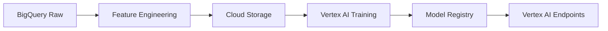

# BQX ML V3 Clean Architecture Guide
**Version**: 3.0 FINAL
**Date**: November 24, 2024
**Platform**: Google Cloud Platform ONLY
**Paradigm**: BQX as Features AND Targets

## 🎯 BQX ML V3 Core Principles

### Architecture Foundation
- **Platform**: 100% Google Cloud Platform
- **Models**: 28 independent currency pair models
- **Data**: BigQuery exclusive data warehouse
- **Compute**: Vertex AI for ML workloads
- **Storage**: Cloud Storage for artifacts
- **NO AWS SERVICES** - Fully migrated to GCP

## 📊 Clean Technology Stack

### GCP Services Only
```yaml
compute:
  - service: Vertex AI Workbench
    purpose: Model development
  - service: Vertex AI Training
    purpose: Distributed training
  - service: Vertex AI Endpoints
    purpose: Model serving

data:
  - service: BigQuery
    purpose: Data warehouse
    datasets: bqx_ml
  - service: Cloud Storage
    buckets:
      - bqx-ml-features
      - bqx-ml-models
      - bqx-ml-experiments

orchestration:
  - service: Cloud Composer
    purpose: Workflow automation
  - service: Cloud Scheduler
    purpose: Batch jobs

monitoring:
  - service: Cloud Monitoring
    purpose: System metrics
  - service: Cloud Logging
    purpose: Application logs
```

## 🔄 Paradigm Shift Implementation

### BQX Feature Engineering (POST-SHIFT)
```sql
-- V3 CLEAN: BQX as both features and targets
CREATE OR REPLACE TABLE `bqx-ml.bqx_ml.lag_bqx_eurusd` AS
SELECT
    bar_start_time,
    open, high, low, close, volume,

    -- BQX values as FEATURES (paradigm shift)
    LAG(bqx_mid, 1) OVER (ORDER BY bar_start_time) AS bqx_mid_lag_1,
    LAG(bqx_mid, 2) OVER (ORDER BY bar_start_time) AS bqx_mid_lag_2,
    -- ... continue to lag_60
    LAG(bqx_mid, 60) OVER (ORDER BY bar_start_time) AS bqx_mid_lag_60,

    -- Standard price lags
    LAG(close, 1) OVER (ORDER BY bar_start_time) AS close_lag_1,
    -- ... continue to lag_60

    -- BQX targets (unchanged)
    bqx_ask,
    bqx_bid,
    bqx_mid

FROM `bqx-ml.bqx_ml.regression_bqx_eurusd`
WHERE bar_start_time >= '2020-01-01';
```

## 🏗️ V3 Pipeline Architecture

### Phase Structure (GCP-Native)
```python
# V3 Clean Pipeline
pipeline = {
    "P03.1": "Foundation Setup (BigQuery datasets)",
    "P03.2": "Feature Engineering (lag, regime, agg, align tables)",
    "P03.3": "Model Training (Vertex AI)",
    "P03.4": "Validation (BigQuery ML)",
    "P03.5": "Deployment (Vertex AI Endpoints)"
}
```

### Data Flow (No AWS)


## 📁 Repository Structure (Clean)

```
bqx_ml_v3/
├── .gcp/                    # GCP configurations only
│   ├── bigquery/
│   ├── vertex-ai/
│   └── storage/
├── src/
│   ├── features/           # Feature engineering
│   │   ├── bqx_lags.py    # BQX as features (NEW!)
│   │   └── price_lags.py
│   └── models/
│       └── pair_models/    # 28 independent models
├── scripts/
│   └── gcp/               # GCP-specific scripts only
└── configs/
    └── vertex_ai/         # Vertex AI configs
```

## 🔧 Implementation Commands (GCP Only)

### BigQuery Setup
```bash
# Create dataset
bq mk --location=us-east1 --dataset bqx-ml:bqx_ml

# Create tables with BQX features
bq query --use_legacy_sql=false < scripts/create_lag_tables.sql
```

### Vertex AI Setup
```bash
# Initialize Vertex AI
gcloud ai custom-jobs create \
  --region=us-east1 \
  --display-name="bqx-ml-v3-training"

# Deploy model
gcloud ai endpoints deploy-model $ENDPOINT_ID \
  --region=us-east1 \
  --model=$MODEL_ID
```

### Cloud Storage Setup
```bash
# Create buckets (GCP only)
gsutil mb -p bqx-ml -c STANDARD -l us-east1 gs://bqx-ml-features/
gsutil mb -p bqx-ml -c STANDARD -l us-east1 gs://bqx-ml-models/
gsutil mb -p bqx-ml -c STANDARD -l us-east1 gs://bqx-ml-experiments/
```

## ✅ V3 Validation Checklist

### Clean Architecture Verification
- [ ] Zero AWS service references
- [ ] All data in BigQuery
- [ ] Models in Vertex AI
- [ ] Storage in Cloud Storage
- [ ] Orchestration in Cloud Composer

### Paradigm Shift Verification
- [ ] BQX values included as features
- [ ] BQX lags implemented (1-60)
- [ ] Autoregressive capability enabled
- [ ] Momentum persistence captured

### GCP Resource Verification
```bash
# Verify GCP resources only
gcloud projects describe bqx-ml
bq ls --dataset_id=bqx_ml
gsutil ls gs://bqx-ml-*
gcloud ai models list --region=us-east1
```

## 🚫 Deprecated / Removed

### No Longer Used (AWS Migration Complete)
- ❌ AWS RDS / Aurora
- ❌ AWS S3
- ❌ AWS Lambda
- ❌ AWS SageMaker
- ❌ Any AWS service references
- ❌ Hybrid cloud architecture
- ❌ Cross-cloud data transfers

## 📈 Performance Targets (V3 Clean)

### Model Metrics
- R² > 0.75 (using BQX features)
- Sharpe Ratio > 1.5
- Max Drawdown < 10%
- Win Rate > 55%

### Infrastructure Metrics
- Query latency < 2s (BigQuery)
- Training time < 4h per model (Vertex AI)
- Inference latency < 100ms (Endpoints)
- Cost < $2,500/month (GCP only)

## 🔐 Security (GCP-Native)

### Service Account
```json
{
  "type": "service_account",
  "project_id": "bqx-ml",
  "client_email": "codespace-bqx-ml@bqx-ml.iam.gserviceaccount.com"
}
```

### IAM Roles
- BigQuery Data Editor
- Vertex AI User
- Storage Object Admin
- Monitoring Viewer

## 🎯 Success Criteria

### V3 Clean Implementation
1. 100% GCP infrastructure
2. Zero AWS dependencies
3. BQX as features implemented
4. 28 independent models deployed
5. Sub-100ms inference latency

---
**This is the authoritative V3 architecture document.**
**No AWS services. Pure GCP implementation.**
**BQX as features AND targets paradigm active.**